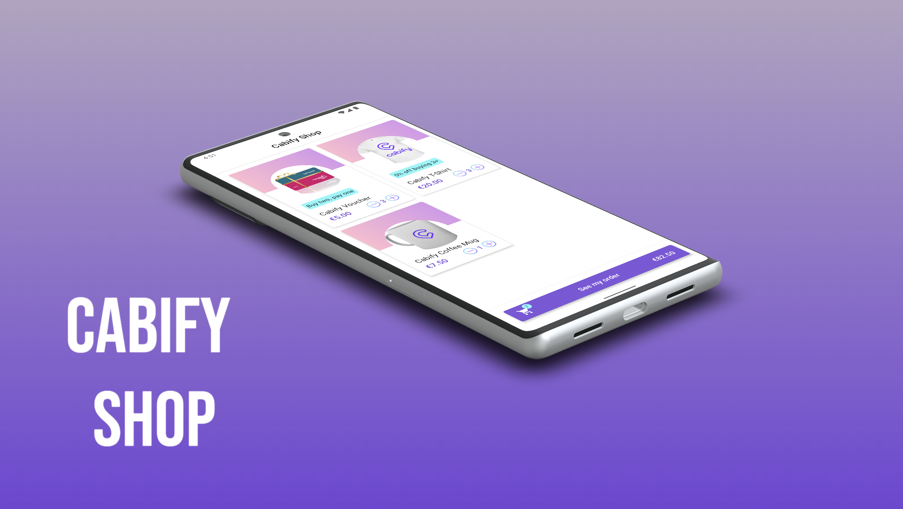
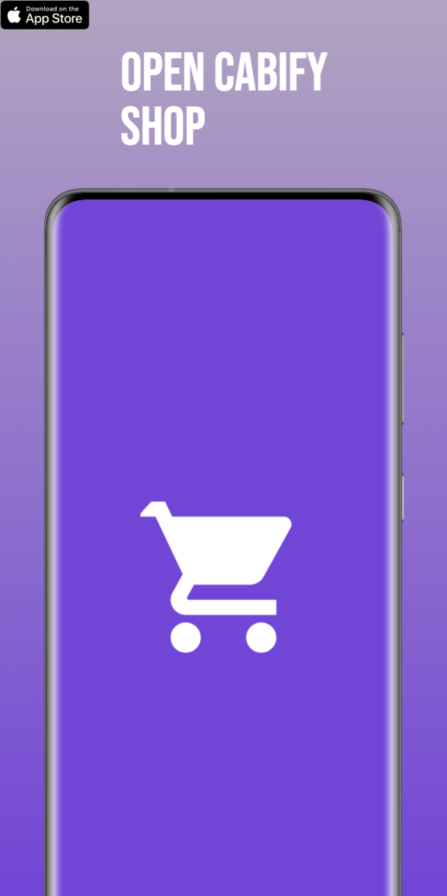
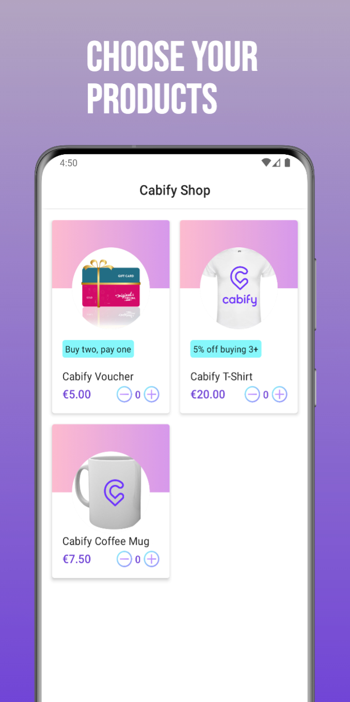
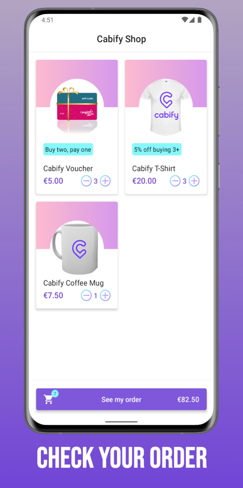
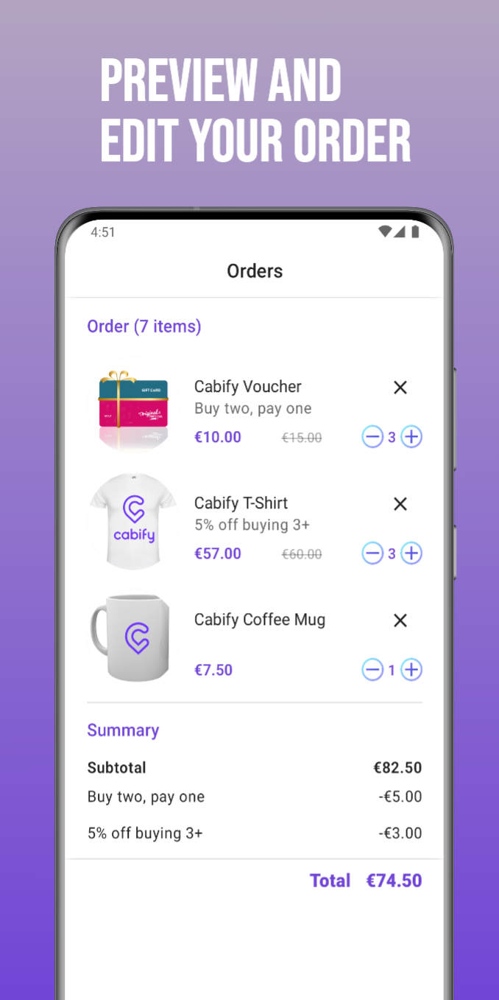
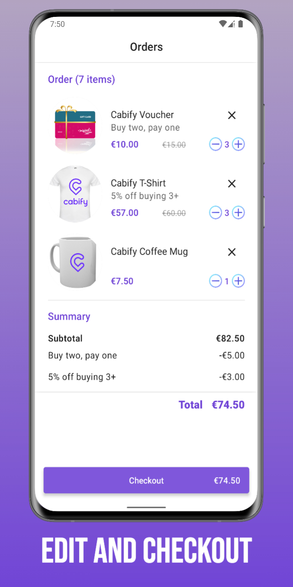
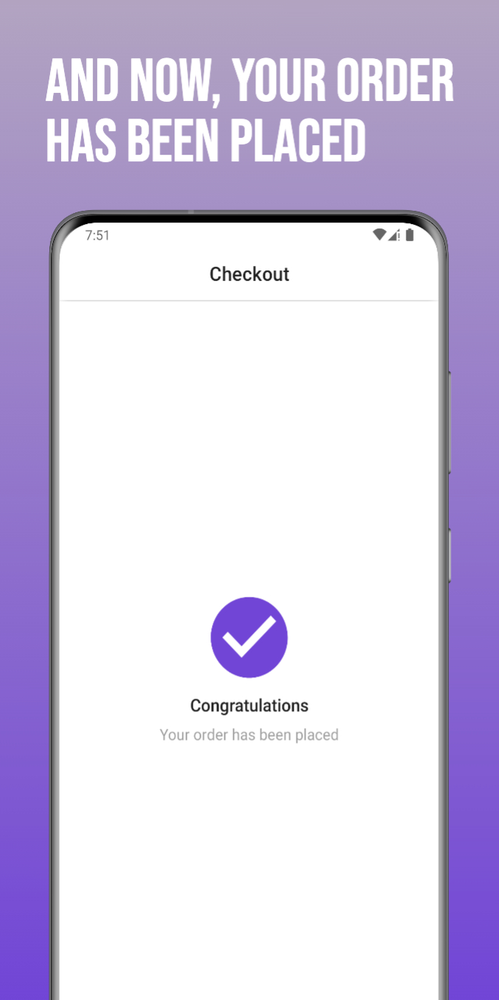
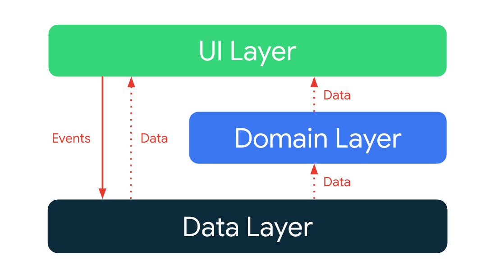
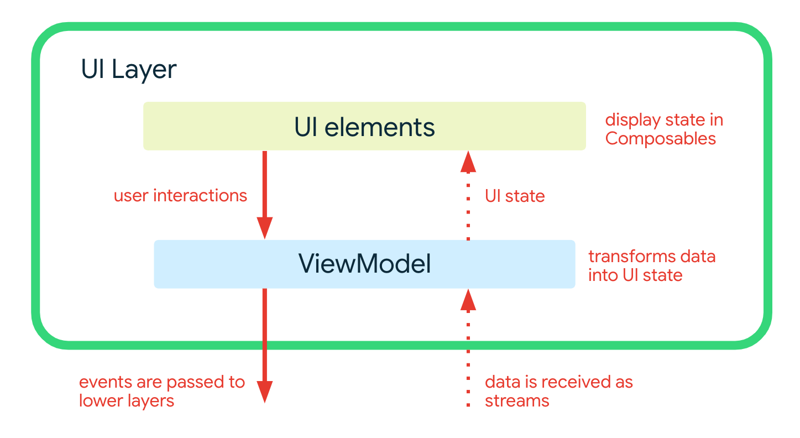

<p align="center">
  <a href="https://www.linkedin.com/in/jmarcecuevas/">
    
  </a>
</p>

<p align="center">
  Built 100% with Jetpack Compose.
</p>

## Table of Contents

- [Introduction](#introduction)
- [Features](#features)
- [Architecture overview](#architecture)
- [Data Layer](#data-layer)
  - [Reading data](#reading-data)
  - [Writing data](#writing-data)
  - [Data sources](#data-sources)
  - [Data synchronization](#data-synchronization)
- [Domain Layer](#domain-layer)
- [Ui Layer](#ui-layer)
  - [Modeling UI state](#modeling-ui-state)
  - [Transforming streams into UI state](#transforming-streams-into-ui-state)
  - [Processing user interactions](#processing-user-interactions)
- [Dependency Injection](#dependency-injection)

<a name="introduction"></a>
## Introduction
This is an unofficial application that responds to a technical challenge for the sole purpose of showing knowledge associated with software development on the Android platform.
Cabify Shop is also a fully functional app built entirely with Kotlin and Jetpack Compose. Moreover, It follows the official architecture guidance as closely as possible.

<a name="features"></a>
## Features
A few of the things you can do with Cabify Shop:

* View products list with their price and promotions (if applicable)
* Add them to cart
* Navigate the app **offline**
* You can add products, exit the app, come back and continue shopping
* Pull to refresh product list when you have network connectivity, so you can sync with the latest
* See the list of products added to the cart and from there modify the amount required or directly delete them from cart
* You can also see for each order the original price and the current price that contains the discounts applied (if applicable)
* Moreover, you can see the detail with each discount applied, the subtotal and the final price to pay

<p align="center">
  
  
  
  
  
  
</p>

<a name="architecture"></a>
## Architecture overview

The app architecture has three layers: a [data layer](https://developer.android.com/jetpack/guide/data-layer), a [domain layer](https://developer.android.com/jetpack/guide/domain-layer) and a [UI layer](https://developer.android.com/jetpack/guide/ui-layer).

<center>

</center>

The architecture follows a reactive programming model with [unidirectional data flow](https://developer.android.com/jetpack/guide/ui-layer#udf). With the data layer at the bottom, the key concepts are:

*   Higher layers react to changes in lower layers.
*   Events flow down.
*   Data flows up.

The data flow is achieved using streams, implemented using [Kotlin Flows](https://developer.android.com/kotlin/flow).

<a name="data-layer"></a>
## Data layer

The data layer is implemented as an offline-first source of app data and business logic. It is the source of truth for all data in the app.
Repositories are the public API for other layers, they provide the _only_ way to access the app data. The repositories typically offer one or more methods for reading and writing data.

<a name="reading-data"></a>
### Reading data

Data is exposed as data streams. This means each client of the repository must be prepared to react to data changes. Data is not exposed as a snapshot (e.g. `getModel`) because there's no guarantee that it will still be valid by the time it is used.

Reads are performed from local storage as **the source of truth**.

_Example: Read a list of orders_

A list of Orders can be obtained by subscribing to `OrdersRepository::getOrderItems` flow which emits `List<OrderItemAndProduct>`.

Whenever the list of orders changes (for example, when a new order is added), the updated `List<OrderItemAndProduct>` is emitted into the stream.

<a name="writing-data"></a>
### Writing data

To write data, the repository provides suspend functions. It is up to the caller to ensure that their execution is suitably scoped.

<a name="data-sources"></a>
### Data sources

A repository may depend on one or more data sources. For example, the `OfflineFirstProductsRepository` depends on the following data sources:

<table>
  <tr>
   <td><strong>Name</strong>
   </td>
   <td><strong>Backed by</strong>
   </td>
   <td><strong>Purpose</strong>
   </td>
  </tr>
  <tr>
   <td>LocalProductsDataSource
   </td>
   <td><a href="https://developer.android.com/training/data-storage/room">Room/SQLite</a>
   </td>
   <td>Persistent relational data associated with Products
   </td>
  </tr>
  <tr>
   <td>ProductsDataSource
   </td>
   <td>Remote API accessed using Retrofit
   </td>
   <td>Data for products, provided through REST API endpoints as JSON.
   </td>
  </tr>
</table>

<a name="data-synchronization"></a>
### Data synchronization

Repositories are responsible for reconciling data in local storage with remote sources. Once data is obtained from a remote data source it is immediately written to local storage. The  updated data is emitted from local storage (Room) into the relevant data stream and received by any listening clients.

This approach ensures that the read and write concerns of the app are separate and do not interfere with each other. However, you can sync by pulling to refresh on the products screen. This will fetch products from remote and update the local database.

<a name="domain-layer"></a>
## Domain layer
The [domain layer](https://developer.android.com/topic/architecture/domain-layer) contains use cases. These are classes which have a single invocable method (`operator fun invoke`) containing business logic.

These use cases are used to simplify and remove duplicate logic from ViewModels. They typically combine and transform data from repositories.

<a name="ui-layer"></a>
## UI Layer

The [UI layer](https://developer.android.com/topic/architecture/ui-layer) comprises:

*   UI elements built using [Jetpack Compose](https://developer.android.com/jetpack/compose)
*   [Android ViewModels](https://developer.android.com/topic/libraries/architecture/viewmodel)

The ViewModels receive streams of data from use cases, and transforms them into UI state. The UI elements reflect this state, and provide ways for the user to interact with the app. These interactions are passed as events to the ViewModel where they are processed.



<a name="modeling-ui-state"></a>
### Modeling UI state

UI state is modeled as a sealed hierarchy using interfaces and immutable data classes. State objects are only ever emitted through the transform of data streams. This approach ensures that:


*   the UI state always represents the underlying app data - the app data is the source-of-truth.
*   the UI elements handle all possible states.

**Example: Orders items on Orders screen**

The list of orders on the Orders screen is modeled using `OrdersUiState`. This is a sealed interface which creates a hierarchy of three possible states:


*   `Loading` indicates that the data is loading.
*   `HasOrders` indicates that there are orders items stored. The HasOrders state contains the list of orders among other properties.
*   `NoOrders` indicates that the there is not order items added into the local database.

The `uiState` is passed to the `OrdersScreen` composable, which handle these states.

<a name="transforming-streams-into-ui-state"></a>
### Transforming streams into UI state

ViewModels receive streams of data as cold [flows](https://kotlin.github.io/kotlinx.coroutines/kotlinx-coroutines-core/kotlinx.coroutines.flow/-flow/index.html) from one or more use cases or repositories. These are [combined](https://kotlin.github.io/kotlinx.coroutines/kotlinx-coroutines-core/kotlinx.coroutines.flow/combine.html) together, or simply [mapped](https://kotlinlang.org/api/kotlinx.coroutines/kotlinx-coroutines-core/kotlinx.coroutines.flow/map.html), to produce a single flow of UI state. This single flow is then converted to a hot flow using [stateIn](https://kotlin.github.io/kotlinx.coroutines/kotlinx-coroutines-core/kotlinx.coroutines.flow/state-in.html). The conversion to a state flow enables UI elements to read the last known state from the flow.

**Example: Displaying order items added to cart**

The `OrdersViewModel` exposes `uiState` as a `StateFlow<OrdersUiState>`. This hot flow is created by obtaining the cold flow of `List<OrderItemAndProduct>` provided by `GetOrdersUseCase`. Each time a new list is emitted, it is converted into an `OrdersUiState` state which is exposed to the UI.

<a name="processing-user-interactions"></a>
### Processing user interactions

User actions are communicated from UI elements to ViewModels using regular method invocations. These methods are passed to the UI elements as lambda expressions.

**Example: Removing an order from cart**

The `OrdersScreen` takes a lambda expression named `removeOrder` which is supplied from `OrdersViewModel.removeOrder`. Each time the user taps on the close icon in an order to remove it, this method is called. The ViewModel then processes this action by using the `DeleteOrderUseCase`.

<a name="dependency-injection"></a>
## Dependency injection

Dependency injection provides your app with the following advantages:

- Reusability of classes and decoupling of dependencies: It's easier to swap out implementations of a dependency. Code reuse is improved because of inversion of control, and classes no longer control how their dependencies are created, but instead work with any configuration.
- Ease of refactoring: The dependencies become a verifiable part of the API surface, so they can be checked at object-creation time or at compile time rather than being hidden as implementation details.
- Ease of testing: A class doesn't manage its dependencies, so when you're testing it, you can pass in different implementations to test all of your different cases.

**Cabify Shop** uses [Hilt](https://developer.android.com/training/dependency-injection/hilt-android?hl=es-419) to manage its dependencies. Hilt's ViewModel (with the
`@HiltViewModel` annotation) works perfectly with Compose's ViewModel integration (`hiltViewModel()`
composable function) as you can see in the following snippet of code. `hiltViewModel()` will
automatically use the factory that Hilt creates for the ViewModel:

```
@HiltViewModel
class HomeViewModel @Inject constructor(
    private val getProducts: GetProductsUseCase,
    private val refreshProducts: RefreshProductsUseCase,
    private val getOrders: GetOrdersUseCase,
    private val updateOrder: UpdateOrderUseCase,
) : ViewModel() { ... }

@Composable
fun HomeRoute(
    modifier: Modifier = Modifier,
    viewModel: HomeViewModel = hiltViewModel(),
    onOrderButtonClick: () -> Unit
) {
    ...
}
```